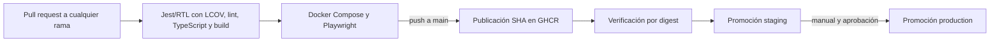

# CI/CD del frontend

**Proyecto:** Menu-Frontend  
**Fecha:** 2026-09-29  
**Estado:** publicación, verificación y promoción de imagen en GHCR implementadas. El despliegue a un host queda pendiente de definir.

## Diseño



La imagen se identifica por el SHA del commit y el digest del manifiesto publicado. Solo `main` publica; los tags `v*` pasan CI, pero no publican. Las etiquetas `staging` y `production` apuntan al mismo digest verificado; la promoción no recompila. Aún no hay destino de ejecución acordado.

## Adaptación del ejemplo

El repositorio [`zackspike/cicd-test`](https://github.com/zackspike/cicd-test) separa verificación y publicación, conserva reportes y publica en GHCR con `GITHUB_TOKEN` solo después de pasar CI. Esos patrones se reflejan aquí. Se sustituyen la matriz, lint, pytest, imagen y configuración Python por npm, ESLint, TypeScript, Jest/React Testing Library, Vite y Playwright. No se trasladan los secretos de Sonar/Discord ni la publicación de `latest`.

Referencias del ejemplo: [`ci.yml`](https://github.com/zackspike/cicd-test/blob/main/.github/workflows/ci.yml), [`template.yml`](https://github.com/zackspike/cicd-test/blob/main/template.yml), [`QUICKSTART.md`](https://github.com/zackspike/cicd-test/blob/main/QUICKSTART.md) y [`dockerfile`](https://github.com/zackspike/cicd-test/blob/main/dockerfile).

## Workflow implementado

El archivo `.github/workflows/ci-cd.yml` ejecuta en todos los pull requests y en pushes a `dev` o `main`, tags `v*` y manualmente:

GitHub requiere que el archivo ya esté en la rama predeterminada para ofrecer `workflow_dispatch`. El push a `dev` se dispara en cuanto la versión modificada del workflow está comprometida y subida a esa rama.

1. **Quality and unit tests:** configura Node desde `.node-version`, usa npm 12.1.0, instala con `npm ci`, ejecuta primero Jest/RTL con cobertura Babel/Istanbul, conserva `coverage/` como artefacto y comprueba que `coverage/lcov.info` no está vacío. Después ejecuta ESLint, typecheck con TypeScript 7 y build Vite. La subida del reporte se intenta incluso si fallan los tests, y un reporte ausente falla el paso. La generación de cobertura precede a lint/typecheck para conservar el reporte aunque estos fallen. `sonar-project.properties` indica la ruta LCOV al futuro scanner; la configuración del servidor y sus credenciales se describe en el README.
2. **Playwright E2E:** después del job de calidad instala Chromium, construye y levanta la imagen de producción con `docker compose up --wait`, ejecuta la suite sobre Chromium y conserva reportes, XML JUnit, trazas y capturas como artefacto. Baja Compose al terminar incluso ante errores.
3. **Publish and verify image:** solo se activa para pushes a `main` y requiere que calidad y E2E pasen. Publica `ghcr.io/<owner>/<repo>:<commit-sha>` con `GITHUB_TOKEN`, captura el digest y descarga la imagen por ese digest. Comprueba la etiqueta OCI de revisión, el healthcheck y la configuración externa servida por Nginx.
4. **Promote to staging:** tras verificar, asigna `:staging` al digest publicado y comprueba que el digest resultante coincide. Usa el entorno GitHub `staging`.
5. **Promote to production:** `promote-production.yml` acepta manualmente un SHA completo de `main`, comprueba que la imagen publicada declara esa revisión y asigna `:production` al mismo digest. Usa el entorno GitHub `production`, donde deben configurarse revisores y restricciones de rama. Un SHA anterior permite revertir la promoción.

Las acciones externas están fijadas por SHA completo. `.github/dependabot.yml` propone actualizaciones semanales para Actions y npm. GitHub requiere configuración del repositorio fuera del workflow: proteger `main`, exigir los checks `Quality and unit tests` y `Playwright E2E`, habilitar escritura de Actions en el paquete GHCR y configurar los entornos `staging` y `production`. Restringir `production` a `main` y añadir revisores requeridos. `GITHUB_TOKEN` aporta `packages: write`; no se almacenan credenciales de registry adicionales. Los resúmenes de Actions registran imagen, digest y SHA para rastrear cada promoción.

## Imagen y Compose

`Dockerfile` compila la SPA en Node y sirve los estáticos desde Nginx como usuario no-root. El endpoint `/healthz` es healthcheck de Docker y Compose. `compose.yaml` publica el puerto 8080 del contenedor en `4173` por defecto (`FRONTEND_PORT` lo cambia) y Compose espera que esté sano antes de iniciar E2E. Al arrancar, `API_BASE_URL` genera `/runtime-config.js` fuera del build de Vite; Nginx lo sirve sin caché. El valor debe ser una URL HTTP(S) sin query ni fragmento, que normalmente termina en `/api/v1`. La imagen usa el mismo digest en todos los entornos; cambia solo esta variable. Como el navegador ve esta URL, no debe contener secretos.

Comandos locales:

```sh
npm ci
npm run lint
npm run typecheck
npm run test:unit
npm run build
docker compose up --build --wait
PLAYWRIGHT_BASE_URL=http://127.0.0.1:4173 npm run test:e2e
docker compose down
```

En PowerShell se puede omitir `PLAYWRIGHT_BASE_URL` si se deja el valor predeterminado de la configuración.

## Versiones y límites conocidos

Se aplicaron las versiones del texto adjunto. TypeScript 7.0.2 es el compilador principal (`@typescript/native`); `typescript` apunta al paquete de compatibilidad API TypeScript 6.0.2 para herramientas del ecosistema. El paquete `@eslint/js` no publica la versión `10.10.0`; el manifiesto fija la versión existente `10.0.1` junto con ESLint `10.10.0`.

La UI en `src/App.tsx` es una pantalla mínima para ejercitar los pipelines; falta integrar vistas y API del servicio de menú. En esta rama se verificaron lint, tipos, Jest/RTL, build de Vite, sintaxis YAML y `docker compose config`. El daemon local de Docker no está activo, así que la publicación, healthcheck del contenedor y promoción por digest requieren la primera corrida de GitHub Actions tras el merge a `main`. El build local usó Node 24.14.1 y npm 11.20.0; el workflow usa Node 24.21.0 y npm 12.1.0.

La UI todavía no consulta el backend; el endpoint real de API y el host de despliegue siguen pendientes de acuerdo. Las variables `VITE_*` quedan incorporadas al bundle del navegador y no deben contener secretos; para la URL de API se usa `API_BASE_URL` al arrancar el contenedor.

## Referencias técnicas

- [GitHub Actions: Node.js](https://docs.github.com/en/actions/tutorials/build-and-test-code/nodejs), [seguridad y permisos](https://docs.github.com/en/actions/reference/security/secure-use) y [GITHUB_TOKEN](https://docs.github.com/en/actions/tutorials/authenticate-with-github_token).
- [Playwright: CI](https://playwright.dev/docs/ci) y [Docker](https://playwright.dev/docs/docker).
- Docker: [Compose `config`](https://docs.docker.com/reference/cli/docker/compose/config/), [`up --wait`](https://docs.docker.com/reference/cli/docker/compose/up/) y [buenas prácticas de build](https://docs.docker.com/build/building/best-practices/).
- [Vite: variables y modos](https://vite.dev/guide/env-and-mode); [npm `ci`](https://docs.npmjs.com/cli/commands/npm-ci/).
- Versiones confirmadas en npm: [`eslint@10.10.0`](https://www.npmjs.com/package/eslint/v/10.10.0), [`@eslint/js@10.0.1`](https://www.npmjs.com/package/@eslint/js/v/10.0.1).
