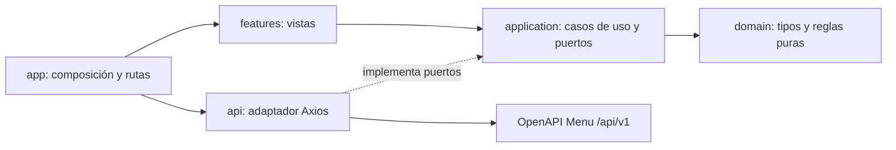

# Arquitectura del frontend de Menu

**Estado:** decisión de arquitectura para las vistas e integración de Menu. T22 implementa la primera vista administrativa, el puerto de aplicación y el adaptador HTTP; las demás capacidades se incorporan por tarea.
**Referencias:** ERS y contrato API vigentes en `Menu-Documentation/main`, y arquitectura de `Menu-Backend/main`. Véanse las [brechas de T22](T22-catalogo-administrable.md).

## Fuentes y alcance

- [Configuración de la ERS](https://github.com/FMAT-Restaurant/Menu-Documentation/blob/main/docs/ers/configuration.md) establece la precedencia: modelo conceptual y ERS vigentes prevalecen sobre auditorías y propuestas históricas en `docs/other/md/`.
- [Modelo conceptual](https://github.com/FMAT-Restaurant/Menu-Documentation/blob/main/docs/other/md/domain-model.md), [requisitos](https://github.com/FMAT-Restaurant/Menu-Documentation/blob/main/docs/ers/functional-requirements.md), [reglas](https://github.com/FMAT-Restaurant/Menu-Documentation/blob/main/docs/ers/business-rules.md), [cuestiones abiertas](https://github.com/FMAT-Restaurant/Menu-Documentation/blob/main/docs/ers/open.md) y [roadmap](https://github.com/FMAT-Restaurant/Menu-Documentation/blob/main/docs/product/README.md) definen el comportamiento y las entregas.
- [OpenAPI](https://github.com/FMAT-Restaurant/Menu-Documentation/blob/main/docs/apis/menu/openapi.yaml) es la fuente de operaciones, rutas, cuerpos, respuestas y errores.
- [Arquitectura del backend](https://github.com/FMAT-Restaurant/Menu-Backend/blob/main/docs/arch.md) define el servicio. El frontend separa vistas, puerto de aplicación y adaptador HTTP sin copiar detalles de Java, JPA ni repositorios.

La aplicación es una **SPA web de administración y consulta de catálogo**. Menu conserva entradas, ofertas, composiciones, recetas y personalizaciones; Inventario conserva identidad y existencias de artículos; Órdenes conserva elecciones concretas y precio final. El frontend no calcula reglas autoritativas del dominio ni convierte una definición de catálogo en una orden.

## Decisión tecnológica

Usar React, TypeScript, React Router, Axios y Vite conforme a [`docs/stack.md`](https://github.com/FMAT-Restaurant/Menu-Documentation/blob/main/docs/stack.md) y al plan [MVP1-T001](https://github.com/FMAT-Restaurant/Menu-Documentation/blob/main/docs/product/mvp-01-catalogo-publicable.md). Jest y React Testing Library cubren componentes y casos de uso; Playwright cubre recorridos en navegador. Node.js y npm son herramientas de desarrollo y build. `package.json` fija las versiones y declara TypeScript 7.0.2 en `@typescript/native` junto al alias de compatibilidad TypeScript 6. `npm run typecheck` y `npm run build` invocan `tsc`, que resuelve a TypeScript 7.0.2; `tsc6` queda disponible para las herramientas que todavía necesitan la API anterior. La versión del compilador principal se verificó con `npm exec -- tsc --version`.

## Límite del repositorio

`Menu-Frontend` contiene la SPA web, sus pruebas, configuración de build, contenedor y documentación de implementación del cliente. `Menu-Backend` conserva el servicio HTTP, las invariantes y la persistencia. `Menu-Documentation` conserva el modelo conceptual, la ERS y el contrato OpenAPI aceptado. Los tipos de transporte del frontend deben seguir ese contrato; no se copian entidades JPA ni se crea aquí una segunda definición normativa de la API. Las integraciones con Inventario y Órdenes se agregan cuando existan sus contratos aprobados.

El proyecto de la rama `dev` ya utiliza una **SPA web**, acorde con React Router/Vite y las pruebas E2E en navegador del plan. Un cliente móvil exigiría otra decisión y otra estrategia de navegación/build.

## Estructura y dependencias

El proyecto usa `src/App.tsx` para composición y rutas. Organizar las vistas de Menu por capas y áreas de dominio:

```text
src/
  app/                    # arranque, rutas, composición de dependencias y proveedores
  api/                    # adaptadores HTTP: cliente Axios, operaciones, DTOs y errores
  application/            # casos de uso y puertos para consultar/mutar Menu
  domain/                 # tipos y reglas puras de presentación del catálogo
  features/               # vistas y componentes por capacidad
    catalog/
    categories/
    entries/
    offers/
    compositions/
    recipes/              # MVP-2
    personalizations/     # MVP-3
  shared/                 # componentes UI, utilidades y estado de interfaz reutilizables
tests/
  e2e/                   # recorridos Playwright
```

| Capa | Responsabilidad | Depende de |
| --- | --- | --- |
| `features` | Rutas/vistas, formularios, estados de carga, errores y controles de usuario. Agrupa por capacidad, no crea reglas comerciales propias. | `application`, `domain`, `shared` |
| `application` | Coordina casos de uso, paginación, transformación de DTOs, invalidación/recarga tras escrituras y puertos de acceso. | `domain` |
| `domain` | Tipos de Menu y funciones puras para expresar estados y validaciones inmediatas documentadas. | Ninguna capa del proyecto |
| `api` | Implementa puertos de aplicación con Axios, rutas/verbos/cuerpos OpenAPI, mapeo de respuestas y errores. | `application` (contratos), `domain` |
| `app` | Crea adaptadores, configura rutas y entrega dependencias a las vistas. | Todas, solo como punto de composición |
| `shared` | Piezas de interfaz y utilidades sin conocimiento de Menu. | Ninguna capa de negocio |



`features` no importa Axios ni DTOs HTTP. `api` no importa componentes React. `domain` no depende de React, Axios ni del backend. Los tipos de transporte viven en `api`; si difieren del lenguaje usado por la UI, se convierten en el adaptador o caso de uso, sin duplicar entidades por anticipado. La organización de carpetas no impide imports erróneos: ESLint y revisión de PR deben vigilar estos límites.

**Correspondencia con el backend:** la capa `features` cumple el papel de entrada de usuario que `api` cumple para HTTP en el backend; `application` coordina el flujo; `domain` expresa conceptos compartidos del contrato sin duplicar la autoridad del servidor; `api` es infraestructura de red. Los nombres no implican que una entidad JPA se envíe al navegador. El backend separa DTOs HTTP de entidades; el frontend también conserva esa frontera.

## Integración con Menu

1. Configurar una base URL externa que incluya `/api/v1`, como indica el campo `servers` de OpenAPI. En desarrollo, Vite puede usar un proxy hacia el backend; en despliegue, la URL se configura para cada entorno. No incrustar secretos en el bundle.
2. Mantener una función por `operationId` del contrato para categorías, entradas, ofertas, catálogo publicable, composiciones y, después, recetas. Centralizar codificación de parámetros, `Content-Type`, parseo de `Error { code, message, details }` y cancelación de solicitudes al salir de una vista. Los identificadores y revisiones son **cadenas opacas**.
3. Usar la respuesta del servidor como estado confirmado. Un formulario mantiene su borrador local y solo actualiza el recurso confirmado tras éxito. Las validaciones locales mejoran la respuesta inmediata; el backend decide invariantes, transiciones y aceptación final. En 400/404/409/415/422, conservar el borrador y mostrar el mensaje y los detalles asociados a campos cuando existan.
4. Para crear o actualizar entradas, el contrato vigente usa JSON con `imageId`; la carga del archivo corresponde al endpoint de imágenes. Las vistas de edición y ofertas aplicarán sus contratos vigentes cuando se implementen. Validar archivos antes de enviarlos y conservar el borrador ante 415/422.
5. El catálogo publicable usa `limit` y cursor opaco `nextCursor`, siempre con los mismos filtros al continuar; no inventar un total. Las listas administrativas usan `page` desde 1, `pageSize` y los totales devueltos. Una búsqueda nueva reinicia el cursor o la página. El contrato define `q` y `categoryId` para catálogo publicable; la semántica de búsqueda la decide el servicio.
6. El frontend distingue consulta publicable de administración. No filtra una lista administrativa para simular `/catalog`: el servidor excluye entradas u ofertas no publicables. Mostrar `brandName` de la entrada y `presentationTag` de la oferta por separado; mostrar `basePrice` tal como viene, sin sumar slots, opciones ni ofertas hijas.
7. La lista administrativa usa las URL de `image` que entrega la API. No construir URL de imágenes a partir de identificadores opacos.

**Seguridad y concurrencia:** el OpenAPI vigente define Bearer y exige `If-Match` para las mutaciones de entradas. T22 obtiene el `ETag` de `GET /menu/entries/{entryId}` antes de `PATCH` o `DELETE`. La integración de autenticación se hará cuando exista el flujo de identidad. La seguridad por menú y las transiciones las aplica el servidor; ocultar controles en la UI no constituye autorización.

## Flujos y módulos por entrega

| Entrega | Vistas/casos de uso | Operaciones del contrato |
| --- | --- | --- |
| MVP-1 | Categorías; lista/detalle/edición de entradas; ofertas; editor de composición; catálogo publicable. Publicar exige primero oferta válida y luego entrada activa. Desarchivar deja la entrada inactiva. | `listMenuCategories`, `createMenuCategory`, `patchMenuCategory`; `listMenuEntries`, `createMenuEntry`, `getMenuEntry`, `patchMenuEntry`; `listEntryOffers`, `createEntryOffer`, `getEntryOffer`, `setEntryOfferStatus`; `getOfferComposition`, `replaceOfferComposition`; `listPublishedCatalog`, `getPublishedCatalogEntry` |
| MVP-2 | Bibliotecas y recetas; revisiones de recetas y ofertas; fuentes `INLINE`, `PREPARATION` y `CATALOG_OFFER`. | Operaciones `recipe-libraries`, revisiones de oferta/receta y composición existente |
| MVP-3 | Personalizaciones por `ComponentOption`. La confirmación de eliminación de entrada archivada se adelanta a T22; el Back aún no ofrece el endpoint ni la garantía de conservar revisiones publicadas. | `replaceOfferComposition` y consultas de revisiones |

El editor de composición debe separar: (a) inclusión de slots (`selectable`, `requiredSlots`, límites de elegibles), (b) elección de una opción para cada slot incluido, y (c) cantidad y curso descriptivos del slot. Una opción pertenece a una aparición concreta; sus personalizaciones no se comparten automáticamente con otra aparición del mismo origen. El frontend puede explicar estas reglas y validar formas evidentes, pero no declarar una oferta publicable antes de la respuesta del backend.

La especificación semántica de vistas y flujos, cuando se escriba, seguirá [UI Specification Architecture](https://github.com/FMAT-Restaurant/Menu-Documentation/blob/main/docs/other/ui-spec-arch.md): YAML para las vistas, Mermaid para navegación y flujos, trazabilidad a `REQ-MENU-*`, y documentos derivados generados. Esta arquitectura de código no reemplaza esa especificación ni fija colores o maquetas.

## Estado y pruebas

- Estado remoto: cada consulta se carga por sus filtros, página/cursor e identificadores. Tras una mutación exitosa, volver a consultar los recursos afectados. No mantener una copia global mutable de todo el catálogo.
- Estado local: formularios, selección de archivo, expansión de secciones y confirmaciones. No persistir borradores sensibles o datos de administración en almacenamiento del navegador por defecto.
- Rutas: incluir los identificadores necesarios en la URL de cada vista; los filtros/páginas navegables pueden ir en query params. El contrato vigente no usa `menuId` en las rutas V1. La política de acceso a rutas se añade cuando se aprueben identidad y permisos.
- Probar `domain` y `application` con Jest para reglas/transformaciones que aporten valor; componentes con React Testing Library para acciones y estados visibles; adaptadores con respuestas y errores representativos del contrato; recorridos Playwright para crear/editar con imagen, rechazos 415/422, publicación y paginación. Evitar tests que solo reflejen la implementación.
- La CI actual ejecuta lint, verificación de tipos, build Vite, pruebas unitarias y E2E en navegador, y construye una imagen. Las pruebas de V1 verifican los parámetros, cuerpos y encabezados del contrato vigente. Playwright mide la experiencia visible; la herramienta de generación de carga sigue sin decidirse.

## Decisiones pendientes que afectan implementación

| Tema | Límite actual |
| --- | --- |
| Inventario | No hay contrato para buscar `InventoryItem` ni validar su unidad. El origen del identificador y el selector de UI requieren acuerdo; no crear un endpoint de Inventario en Menu. |
| Imágenes | El contrato vigente entrega URL de imagen en las respuestas de entradas. La integración de carga se incorporará con V2. |
| Seguridad | El contrato define Bearer; aún falta integrar identidad y autorización entre Front y Back. |
| Concurrencia | `ETag`/`If-Match` rige las mutaciones de entradas. La política de otras capacidades se seguirá por sus contratos. |
| Dominio | OPEN-001/002/003/006/007/008/009 siguen pendientes. No fijar moneda, precisión, default implícito, alcance de biblioteca, unidades/rangos, lista cerrada de cursos ni validez de opciones activas por inferencia. |
| Operación | El contrato aceptado declara OpenAPI 3.1.0; `stack.md` menciona 3.2.1. Mantener compatibilidad con el contrato hasta una revisión formal. La imagen ya se publica en GHCR; faltan destino de despliegue, URL de API por entorno y política de recuperación. |

## Criterio para cerrar esta decisión

T22 incorpora consultas y mutaciones de Menu detrás de un puerto de `application`, mantiene los límites de dependencias y amplía las pruebas. La integración de eliminación, ofertas y publicación depende de los cambios de Back enumerados en [T22](T22-catalogo-administrable.md).
