# Mapa de UI — Vista Administrador

**Fuente visual:** [mockup de administración](../mockups/mockups_vista_Administrador.html).  
**Convención:** R indica componente reutilizable; E indica componente específico de una vista. Las capturas muestran el estado visual de referencia. La sección de componentes permite enlazar cada ID directamente desde los tickets.

## Jerarquía de vistas

### V1. Catálogo del menú — página principal · HTML 32–85

- [C01](#c01) Barra global de navegación (R).
- [C02](#c02) Encabezado de vista (R): accesos a biblioteca de recetas, categorías y nueva entrada.
- [C03](#c03) Filtros de catálogo (E): búsqueda, categoría, estado y limpieza.
  - [C23](#c23) Campo de búsqueda (R).
- [C04](#c04) Resumen y paginación (E).
- [C05](#c05) Cuadrícula de entradas (E).
  - [C06](#c06) Tarjeta de entrada (R).
- [C07](#c07) Estado vacío (R).

Ejemplo visual — V1. Catálogo del menú

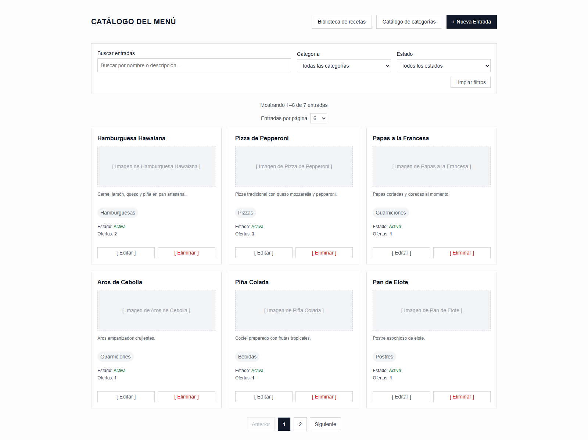

### V2. Crear / editar entrada · HTML 88–141

- [C01](#c01) Barra global de navegación (R).
- [C08](#c08) Formulario de entrada (E).
  - [C09](#c09) Selector múltiple de categorías (E).
  - [C10](#c10) Selector de estado (R), variante de entrada.
  - [C11](#c11) Selector de imagen (R), imagen de referencia de entrada.
  - [C12](#c12) Acciones de formulario (R).

Ejemplo visual — V2. Crear o editar entrada

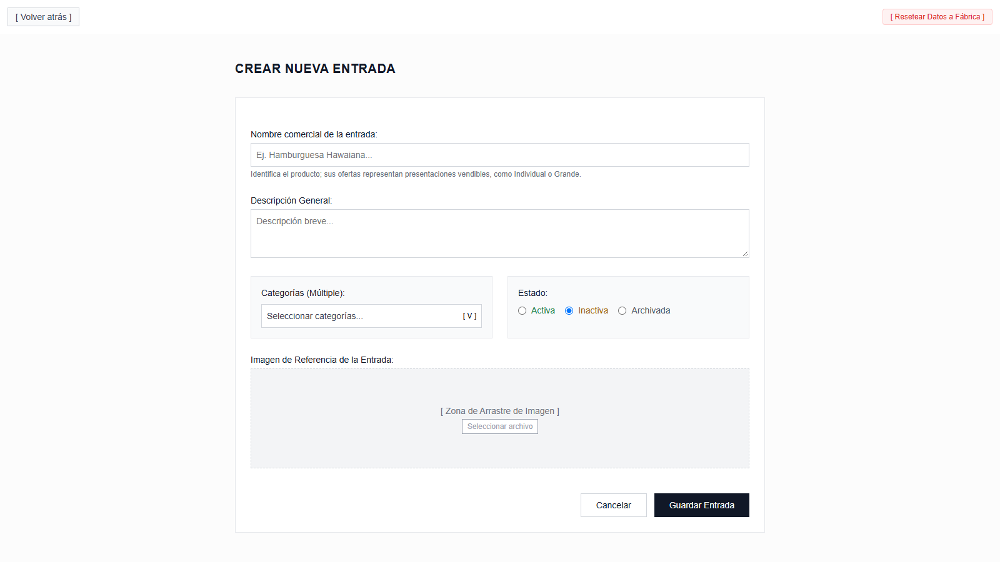

### V3. Ofertas de una entrada · HTML 144–156

- [C01](#c01) Barra global de navegación (R).
- [C02](#c02) Encabezado de vista (R): identidad de entrada y acción de nueva oferta.
  - [C13](#c13) Cuadrícula de ofertas (E).
  - [C14](#c14) Tarjeta de oferta (R).
- [C07](#c07) Estado vacío (R).

Ejemplo visual — V3. Ofertas de una entrada

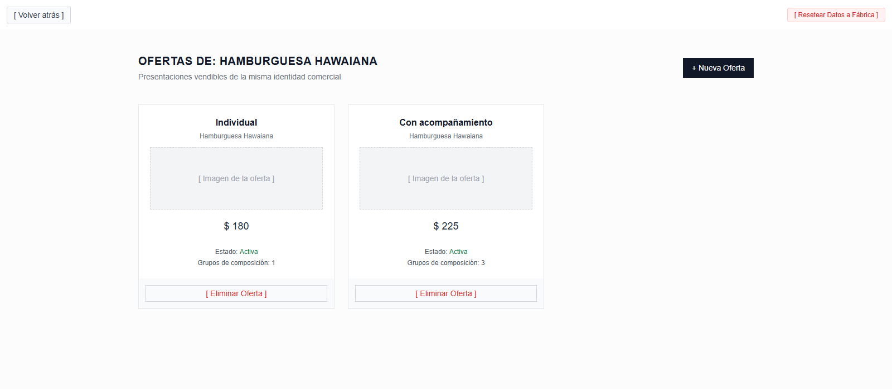

### V4. Crear / editar oferta · HTML 159–228

- [C01](#c01) Barra global de navegación (R).
- [C02](#c02) Encabezado de vista (R): entrada asociada y salida con cambios pendientes.
- [C15](#c15) Información comercial (E): etiqueta, precio base, estado e imagen.
  - [C10](#c10) Selector de estado (R), variante de oferta.
  - [C11](#c11) Selector de imagen (R), imagen de la oferta.
- [C16](#c16) Editor de composición (E): copiar composición, consultar slots y agregar slot.
  - [C17](#c17) Tarjeta de slot, llamada grupo en el mockup (R).
    - [C18](#c18) Opción de contenido (R).
- [C12](#c12) Acciones de formulario (R).
- [C31](#c31) Formulario de slot, modal de crear / editar.
- [C32](#c32) Editor de opción, modal con acceso a V6 o V7.

Ejemplo visual — V4. Crear o editar oferta

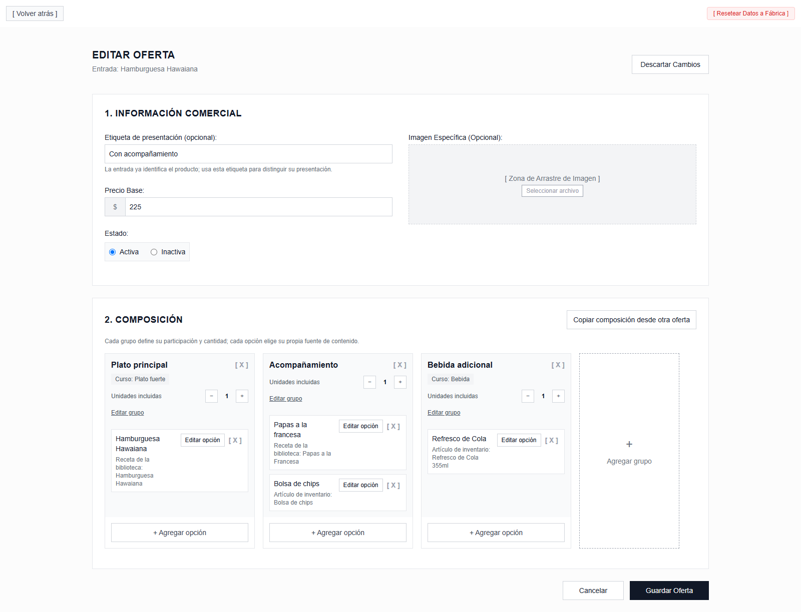

### V5. Catálogo de categorías — vista superpuesta · HTML 384–406

- [C19](#c19) Encabezado de pantalla completa (R).
- [C20](#c20) Lista de categorías (E).
  - [C21](#c21) Fila de categoría (R).
- [C07](#c07) Estado vacío (R).
- [C22](#c22) Formulario de categoría (E), modal crear / editar.
  - [C12](#c12) Acciones de formulario (R).

Ejemplo visual — V5. Catálogo de categorías

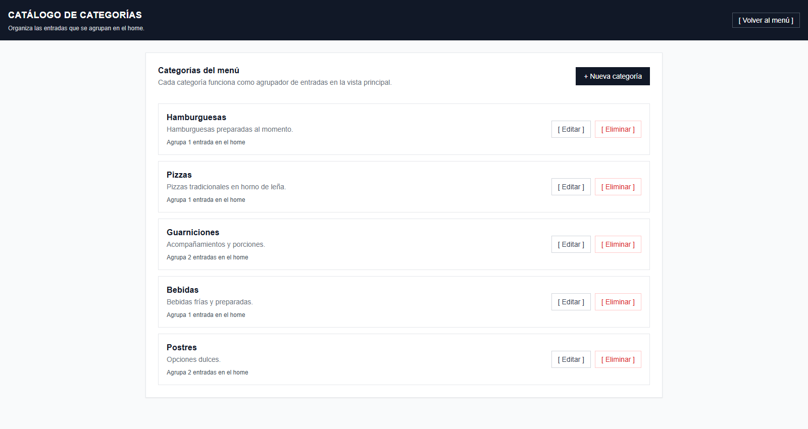

#### Modal V5 · Formulario de categoría · HTML 234–256

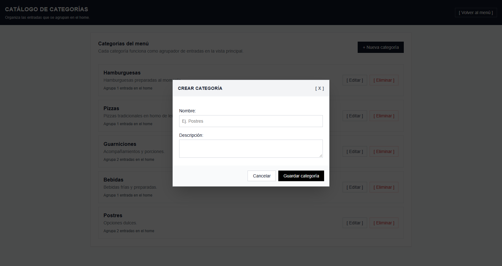

### V6. Biblioteca de recetas — vista superpuesta · HTML 409–425

- [C19](#c19) Encabezado de pantalla completa (R).
- [C23](#c23) Campo de búsqueda (R).
- [C24](#c24) Lista de recetas (E).
  - [C25](#c25) Tarjeta de receta (R): asignar o editar; eliminar sujeto a que no tenga referencias vigentes.
- [C26](#c26) Formulario de receta (E), modal crear / editar.
  - [C27](#c27) Lista de insumos de receta (E).
  - [C12](#c12) Acciones de formulario (R).

Ejemplo visual — V6. Biblioteca de recetas

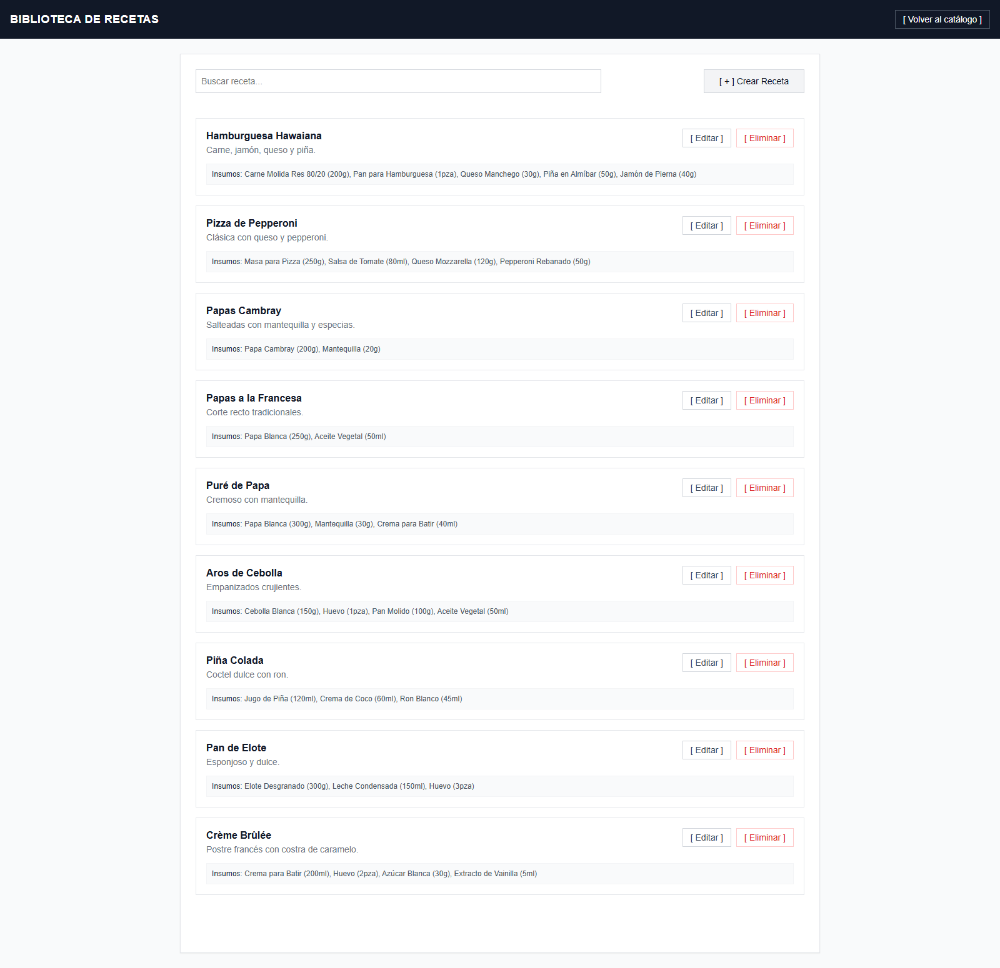

#### Modal V6 · Formulario de receta · HTML 333–378

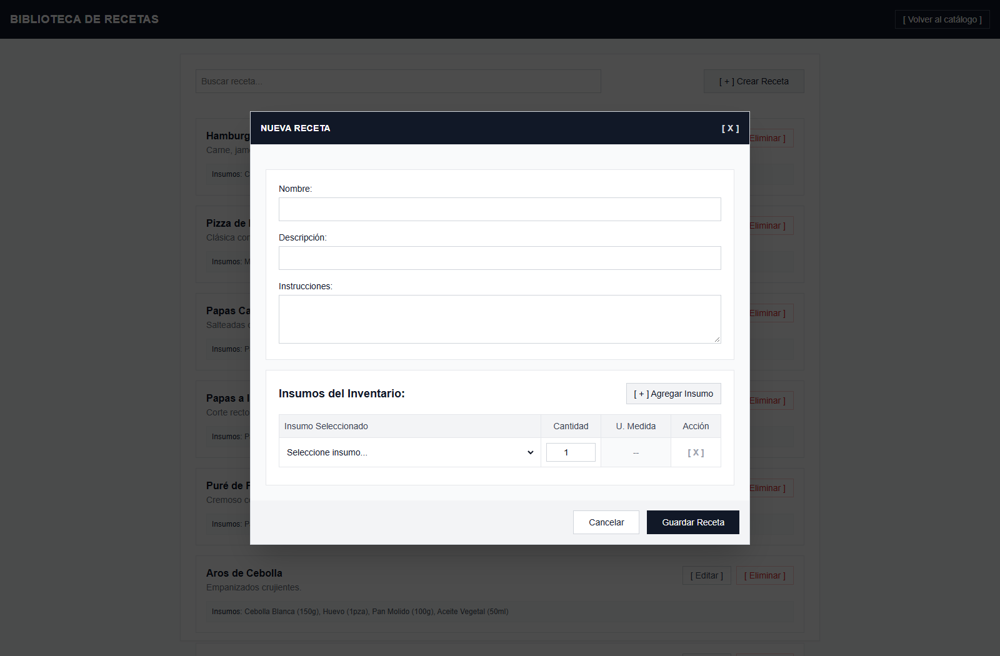

### V7. Seleccionar artículo de inventario · vista superpuesta · HTML 428–448

- [C19](#c19) Encabezado de pantalla completa (R).
- [C23](#c23) Campo de búsqueda (R).
- [C28](#c28) Tabla de selección (R), variante de inventario.
  - [C29](#c29) Fila de selección (R): artículo, unidad y asignación.

Ejemplo visual — V7. Seleccionar artículo de inventario

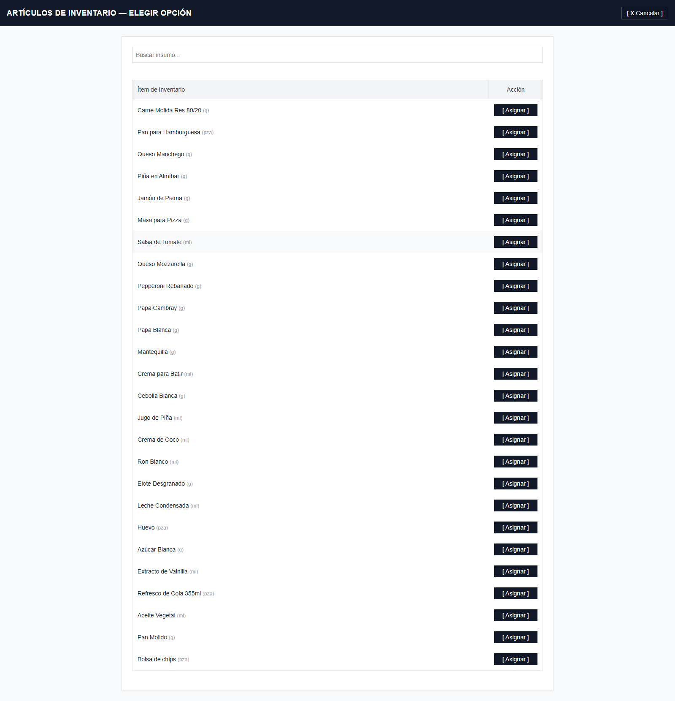

### V8. Copiar composición desde otra oferta · vista superpuesta · HTML 451–468

- [C19](#c19) Encabezado de pantalla completa (R).
- [C28](#c28) Tabla de selección (R), variante de ofertas.
  - [C30](#c30) Fila de oferta para copiar (R).

Ejemplo visual — V8. Copiar composición desde otra oferta

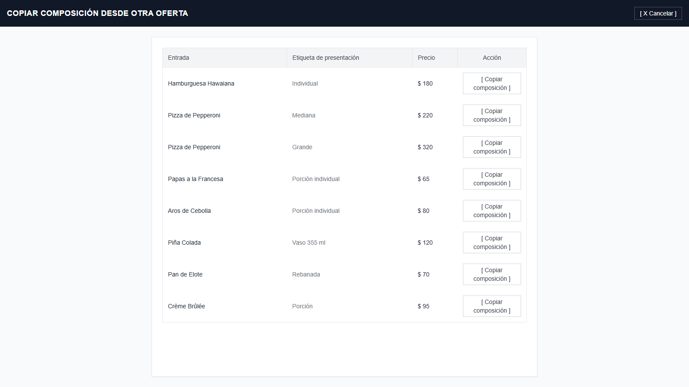

### Capas modales de V4

#### Formulario de slot · HTML 259–292

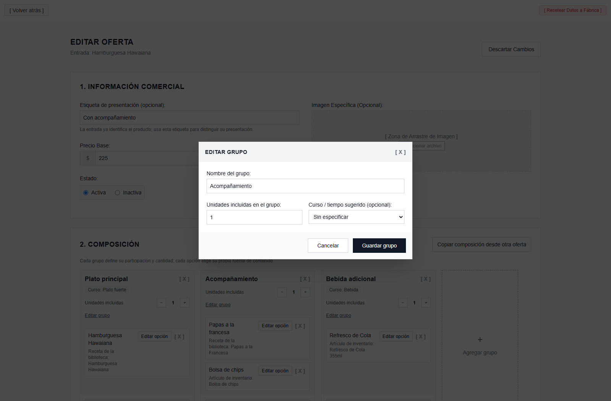

#### Editor de opción · HTML 295–330

El modal permite etiquetar la opción y escoger su origen; desde ahí se abre V6 en modo asignación o V7 para elegir un artículo.

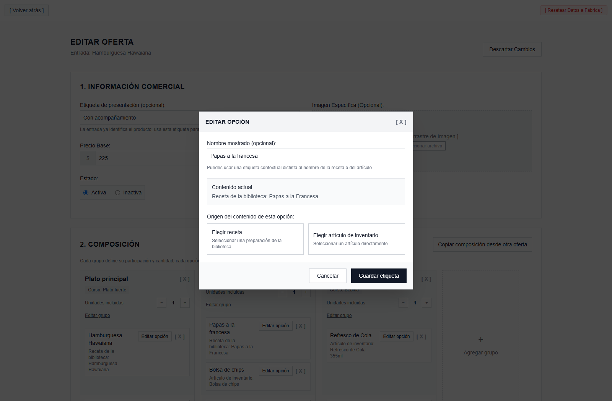

## Índice de componentes

Sigue cada enlace para abrir la ficha y los datos del componente.

| ID | Componente | Vista(s) |
|---|---|---|
| [C01](#c01) | Barra global de navegación | V1–V4 |
| [C02](#c02) | Encabezado de vista | V1, V3, V4 |
| [C03](#c03) | Filtros de catálogo | V1 |
| [C04](#c04) | Resumen y paginación | V1 |
| [C05](#c05) | Cuadrícula de entradas | V1 |
| [C06](#c06) | Tarjeta de entrada | V1 |
| [C07](#c07) | Estado vacío | V1, V3, V5 |
| [C08](#c08) | Formulario de entrada | V2 |
| [C09](#c09) | Selector múltiple de categorías | V2 |
| [C10](#c10) | Selector de estado | V2, V4 |
| [C11](#c11) | Selector de imagen | V2, V4 |
| [C12](#c12) | Acciones de formulario | V2, V4, V5, V6 y modal de V4 |
| [C13](#c13) | Cuadrícula de ofertas | V3 |
| [C14](#c14) | Tarjeta de oferta | V3 |
| [C15](#c15) | Información comercial | V4 |
| [C16](#c16) | Editor de composición | V4 |
| [C17](#c17) | Tarjeta de slot | V4 |
| [C18](#c18) | Opción de contenido | V4 |
| [C19](#c19) | Encabezado de pantalla completa | V5–V8 |
| [C20](#c20) | Lista de categorías | V5 |
| [C21](#c21) | Fila de categoría | V5 |
| [C22](#c22) | Formulario de categoría | V5 |
| [C23](#c23) | Campo de búsqueda | V1, V6, V7 |
| [C24](#c24) | Lista de recetas | V6 |
| [C25](#c25) | Tarjeta de receta | V6 |
| [C26](#c26) | Formulario de receta | V6 |
| [C27](#c27) | Lista de insumos de receta | V6 |
| [C28](#c28) | Tabla de selección | V7, V8 |
| [C29](#c29) | Fila de selección de inventario | V7 |
| [C30](#c30) | Fila de oferta para copiar | V8 |
| [C31](#c31) | Formulario de slot | V4 |
| [C32](#c32) | Editor de opción | V4 |

## Fichas de componentes

### C01 — Barra global de navegación

Vista actual, destino y etiqueta de regreso, y acción de restablecer datos. Se reutiliza para moverse entre vistas administrativas.

**Vistas:** V1, V2, V3 y V4.

### C02 — Encabezado de vista

Título, subtítulo o identidad asociada y acciones disponibles para la vista.

**Vistas:** V1, V3 y V4.

### C03 — Filtros de catálogo

Criterios de búsqueda, categoría y estado, además de la acción para limpiar filtros.

**Vistas:** V1.

### C04 — Resumen y paginación

Total filtrado, intervalo visible, página actual, tamaño de página y total de páginas.

**Vistas:** V1.

### C05 — Cuadrícula de entradas

Colección filtrada y paginada de entradas del catálogo.

**Vistas:** V1.

### C06 — Tarjeta de entrada

Identidad comercial, imagen, descripción, categorías, estado y cantidad de ofertas de una entrada.

**Vistas:** V1; una instancia por entrada.

### C07 — Estado vacío

Mensaje y acción contextual cuando no hay entradas, ofertas o categorías que mostrar o coincidan con los filtros.

**Vistas:** V1, V3 y V5.

### C08 — Formulario de entrada

Valores iniciales para crear una entrada o datos de una entrada existente en edición.

**Vistas:** V2.

### C09 — Selector múltiple de categorías

Categorías del menú actual y categorías seleccionadas para la entrada.

**Vistas:** V2.

### C10 — Selector de estado

Estado actual y acciones permitidas según el tipo de registro. La variante se ajusta al ciclo de vida de entrada u oferta; el estado de una opción se gestiona en C32.

**Vistas:** V2, V4 y C32.

### C11 — Selector de imagen

Imagen vigente y selección de una imagen para la entrada o la oferta. Para ambas entidades la imagen es obligatoria al crear; al editar puede conservarse si no se reemplaza.

**Vistas:** V2 y V4.

### C12 — Acciones de formulario

Acción secundaria y principal del formulario, como cancelar y guardar.

**Vistas:** V2, V4, V5, V6 y modal C31.

### C13 — Cuadrícula de ofertas

Colección de ofertas pertenecientes a una entrada.

**Vistas:** V3.

### C14 — Tarjeta de oferta

Entrada asociada, etiqueta de presentación, imagen, precio base, estado y número de slots.

**Vistas:** V3; una instancia por oferta.

### C15 — Información comercial

Etiqueta de presentación opcional, precio base, estado e imagen de la oferta.

**Vistas:** V4.

### C16 — Editor de composición

Composición de la oferta, colección de slots y acción para seleccionar otra oferta como origen de copia.

**Vistas:** V4.

### C17 — Tarjeta de slot (grupo en el mockup)

Nombre o función del slot, cantidad de rondas, curso opcional, opciones y estado derivado de las opciones. Los slots son miembros estructurales; no tienen una propiedad de opcionalidad.

**Vistas:** V4; una instancia por slot.

### C18 — Opción de contenido

Etiqueta contextual opcional, estado de la opción y origen único: receta o artículo de Inventario.

**Vistas:** V4; una instancia por opción.

### C19 — Encabezado de pantalla completa

Título, acción de salida o cancelación y etiqueta de esa acción.

**Vistas:** V5, V6, V7 y V8.

### C20 — Lista de categorías

Colección de categorías del menú actual y, si se muestra, conteo informativo de entradas asociadas.

**Vistas:** V5.

### C21 — Fila de categoría

Nombre, descripción y conteo informativo de entradas asociadas a la categoría.

**Vistas:** V5; una instancia por categoría.

### C22 — Formulario de categoría

Datos existentes de una categoría o valores iniciales para crear una, como nombre y descripción.

**Vistas:** V5.

### C23 — Campo de búsqueda

Etiqueta y consulta de búsqueda aplicadas a la colección de la vista actual.

**Vistas:** V1, V6 y V7.

### C24 — Lista de recetas

Colección de recetas mostrada en modo de gestión o de asignación.

**Vistas:** V6.

### C25 — Tarjeta de receta

Nombre, descripción, resumen de ingredientes con cantidades y unidades, contexto y acciones permitidas.

**Vistas:** V6; una instancia por receta.

### C26 — Formulario de receta

Valores existentes o iniciales para nombre, descripción, instrucciones e ingredientes.

**Vistas:** V6.

### C27 — Lista de insumos de receta

Filas con artículo de Inventario y cantidad; la unidad se muestra desde el artículo asociado.

**Vistas:** V6.

### C28 — Tabla de selección

Tabla con columnas y acción por fila según el contexto de selección.

**Vistas:** V7 para Inventario y V8 para ofertas origen.

### C29 — Fila de selección de Inventario

Artículo, unidad de medida autoritativa y acción para asignarlo al contexto que abrió V7.

**Vistas:** V7; una instancia por artículo.

### C30 — Fila de oferta para copiar

Entrada asociada, etiqueta de presentación, precio informativo y acción para copiar composición.

**Vistas:** V8; una instancia por oferta candidata.

### C31 — Formulario de slot (grupo en el mockup)

Nombre o función, cantidad de rondas y curso opcional del slot. No incluye un control de requerido/opcional.

**Vistas:** modal de V4.

### C32 — Editor de opción

Etiqueta contextual opcional, estado y tipo/referencia del origen de contenido. Permite abrir V6 en modo de asignación o V7 para seleccionar artículo.

**Vistas:** modal de V4.

## Datos de dominio reconocibles en el mockup

- **CatalogEntry:** identificador, nombre comercial, descripción, imagen de referencia, estado y categorías.
- **CatalogOffer:** identificador, entrada asociada, etiqueta opcional, precio base, estado e imagen propia.
- **CompositionSlot:** identificador, nombre o función, cantidad de rondas, curso opcional y opciones. Todos los slots son estructurales; su estado se deriva de sus opciones.
- **SlotOption:** identificador, etiqueta contextual opcional, estado y un origen, que es una receta o un artículo de Inventario.
- **Category:** identificador, nombre y descripción opcional.
- **Recipe:** identificador, nombre, descripción, instrucciones e ingredientes.
- **Ingrediente de receta:** artículo de Inventario, cantidad y unidad tomada del artículo.
- **Artículo de Inventario:** identificador, nombre y unidad autoritativa.

## Precedencia de la ERS

El mockup sirve como referencia visual y no sustituye la especificación funcional vigente. Al implementar, una creación de entrada u oferta requiere imagen; al editar se puede conservar la existente si no se reemplaza. Todos los slots son estructurales y la participación se determina por el estado derivado de las opciones, sin una regla de slot requerido/opcional.

